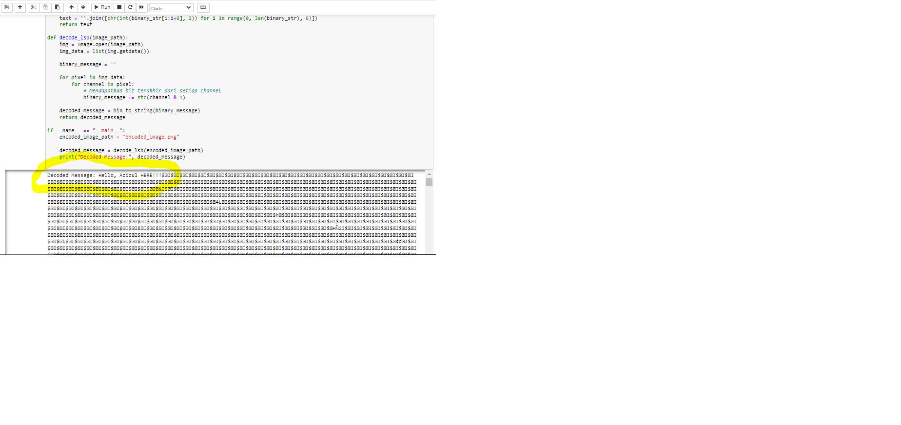

# kriptografi11


# Steganografi dengan Metode LSB (Least Significant Bit)



## Deskripsi

Program ini merupakan contoh implementasi steganografi menggunakan metode LSB pada gambar. Metode ini memanfaatkan bit terakhir dari setiap channel piksel untuk menyisipkan pesan dalam gambar.

## Instalasi

1. Pastikan  memiliki Python terinstal di sistem Anda. Jika belum, Anda dapat mengunduh dan menginstalnya dari [python.org](https://www.python.org/).

2. Instal library Pillow (PIL) dengan menggunakan perintah berikut di terminal atau command prompt:

    ```bash
    pip install pillow
    ```

## Cara Menggunakan

1. Simpan gambar yang ingin gunakan untuk menyisipkan pesan dalam folder yang sama dengan skrip Python.

2. Jalankan skrip encode.py untuk menyisipkan pesan dalam gambar:

    ```bash
    python stegano_encoder.py
    ```

   Skrip akan meminta Anda untuk memasukkan pesan yang ingin disisipkan.

3. Skrip akan membuat gambar baru dengan nama "encoded_image.png" yang berisi pesan yang telah disisipkan.

4. Untuk membaca pesan yang telah disisipkan, jalankan skrip decode.py:

    ```bash
    python stegano_decoder.py
    ```

   Skrip ini akan mencetak pesan yang telah berhasil di-decode.

## Catatan Penting

- Pastikan untuk menggunakan gambar yang telah diencode sebelumnya untuk proses decoding.
- Pesan yang diencode sebaiknya cukup panjang untuk memberikan informasi yang dapat dibaca.


## Lisensi

Proyek ini dilisensikan di bawah [MIT License](LICENSE).

## Fungsi Encode (encode.py)

Berikut adalah contoh kode untuk fungsi encode menggunakan metode LSB:

```python
from PIL import Image

def string_to_bin(message):
    binary_message = ''.join(format(ord(char), '08b') for char in message)
    return binary_message

def encode_lsb(image_path, message):
    img = Image.open(image_path)
    binary_message = string_to_bin(message)

    data_index = 0
    img_data = list(img.getdata())

    for i in range(len(img_data)):
        pixel = list(img_data[i])

        for j in range(3):  # Loop through RGB channels
            if data_index < len(binary_message):
                pixel[j] = pixel[j] & ~1 | int(binary_message[data_index])
                data_index += 1

        img_data[i] = tuple(pixel)

    encoded_img = Image.new(img.mode, img.size)
    encoded_img.putdata(img_data)
    encoded_img.save("encoded_image.png")

if __name__ == "__main__":
    image_path = "path/to/your/image.jpg"
    message = "Hello, this is a secret message!"

    encode_lsb(image_path, message)


 
